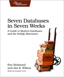

```
Roberto Nogueira  BSd EE, MSd CE
Solution Integrator Experienced - Certified by Ericsson
```

# Seven Databases in Seven Weeks



## Table of Contents

```
Contents

Foreword 
Acknowledgments
Preface 
1. Introduction 
[ ] 1.1 It Starts with a Question
[ ] 1.2 The Genres
[ ] 1.3 Onward and Upward
2. PostgreSQL
[ ] 2.1 That’s Post-greS-Q-L
[ ] 2.2 Day 1: Relations, CRUD, and Joins
[ ] 2.3 Day 2: Advanced Queries, Code, and Rules
[ ] 2.4 Day 3: Full-Text and Multidimensions
[ ] 2.5 Wrap-Up
3. Riak
[ ] 3.1 Riak Loves the Web
[ ] 3.2 Day 1: CRUD, Links, and MIMEs
[ ] 3.3 Day 2: Mapreduce and Server Clusters
[ ] 3.4 Day 3: Resolving Conflicts and Extending Riak
[ ] 3.5 Wrap-Up 
4. HBase
[ ] 4.1 Introducing HBase
[ ] 4.2 Day 1: CRUD and Table Administration
[ ] 4.3 Day 2: Working with Big Data
[ ] 4.4 Day 3: Taking It to the Cloud
[ ] 4.5 Wrap-Up
5. MongoDB
[x] 5.1 Hu(mongo)us
[ ] 5.2 Day 1: CRUD and Nesting
    [x] Command-Line Fun
    [x] Javascript
    [x] Reading:More Fun in Mongo
    [ ] Digging Deep
[ ] 5.3 Day 2: Indexing, Grouping, Mapreduce
[ ] 5.4 Day 3: Replica Sets, Sharding, GeoSpatial, and GridFS
[ ] 5.5 Wrap-Up 
6. CouchDB 
[ ] 6.1 Relaxing on the Couch
[ ] 6.2 Day 1: CRUD, Futon, and cURL Redux
[ ] 6.3 Day 2: Creating and Querying Views
[ ] 6.4 Day 3: Advanced Views, Changes API, and Replicating Data
6.5 Wrap-Up
[ ] 7. Neo4J
[ ] 7.1 Neo4J Is Whiteboard Friendly
[ ] 7.2 Day 1: Graphs, Groovy, and CRUD 
[ ] 7.3 Day 2: REST, Indexes, and Algorithms
[ ] 7.4 Day 3: Distributed High Availability
[ ] 7.5 Wrap-Up
8. Redis
[ ] 8.1 Data Structure Server Store 
[ ] 8.2 Day 1: CRUD and Datatypes
[ ] 8.3 Day 2: Advanced Usage, Distribution
[ ] 8.4 Day 3: Playing with Other Databases
[ ] 8.5 Wrap-Up 
9. Wrapping Up
[ ] 9.1 Genres Redux
[ ] 9.2 Making a Choice
[ ] 9.3 Where Do We Go from Here?
A1. Database Overview Tables
A2. The CAP Theorem 
A2.1 Eventual Consistency
A2.2 CAP in the Wild 
A2.3 The Latency Trade-Off 
Bibliography 
Index 
```
